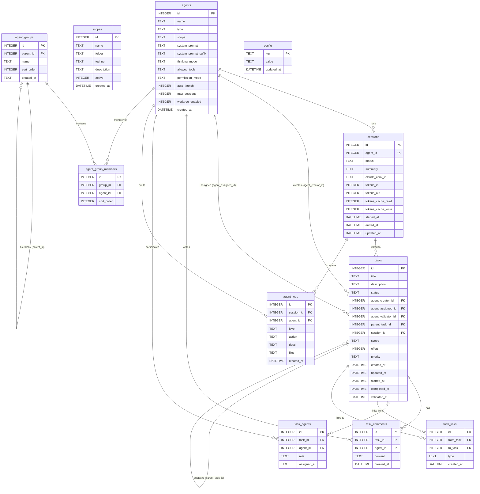

# KanbAgent — Schéma de base de données (v6)

> Généré depuis le schéma SQLite v6. À mettre à jour après chaque migration majeure.

## Relations détaillées

| Table | Colonne FK | Référence | Contrainte |
|---|---|---|---|
| `sessions` | `agent_id` | `agents.id` | NOT NULL |
| `tasks` | `agent_creator_id` | `agents.id` | NOT NULL |
| `tasks` | `agent_assigned_id` | `agents.id` | NOT NULL |
| `tasks` | `agent_validator_id` | `agents.id` | nullable |
| `tasks` | `parent_task_id` | `tasks.id` | nullable (auto-référence) |
| `tasks` | `session_id` | `sessions.id` | nullable |
| `task_comments` | `task_id` | `tasks.id` | NOT NULL |
| `task_comments` | `agent_id` | `agents.id` | NOT NULL |
| `task_agents` | `task_id` | `tasks.id` | NOT NULL, CASCADE DELETE |
| `task_agents` | `agent_id` | `agents.id` | NOT NULL |
| `task_links` | `from_task` | `tasks.id` | NOT NULL |
| `task_links` | `to_task` | `tasks.id` | NOT NULL |
| `agent_logs` | `session_id` | `sessions.id` | NOT NULL |
| `agent_logs` | `agent_id` | `agents.id` | NOT NULL |
| `agent_group_members` | `group_id` | `agent_groups.id` | NOT NULL |
| `agent_group_members` | `agent_id` | `agents.id` | NOT NULL |
| `agent_groups` | `parent_id` | `agent_groups.id` | nullable (hiérarchie) |

## Index notables

| Index | Table | Colonnes |
|---|---|---|
| `idx_sessions_agent_id` | `sessions` | `agent_id` |
| `idx_sessions_started_at` | `sessions` | `started_at DESC` |
| `idx_sessions_agent_started` | `sessions` | `agent_id, started_at DESC` |
| `idx_sessions_status` | `sessions` | `status` |
| `idx_sessions_agent_status` | `sessions` | `agent_id, status, started_at DESC` |
| `idx_task_agents_task_id` | `task_agents` | `task_id` |
| `idx_task_agents_agent_id` | `task_agents` | `agent_id` |
| `idx_task_comments_task_id` | `task_comments` | `task_id` |
| `idx_task_comments_agent_id` | `task_comments` | `agent_id` |
| `idx_task_links_from_task` | `task_links` | `from_task` |
| `idx_task_links_to_task` | `task_links` | `to_task` |
| `idx_agm_group` | `agent_group_members` | `group_id` |

## Contraintes CHECK notables

| Table | Colonne | Valeurs autorisées |
|---|---|---|
| `tasks` | `status` | `todo`, `in_progress`, `done`, `archived` |
| `tasks` | `priority` | `low`, `normal`, `high`, `critical` |
| `tasks` | `effort` | `1`, `2`, `3` |
| `sessions` | `status` | `started`, `completed`, `blocked` |
| `agents` | `thinking_mode` | `auto`, `disabled` |
| `agents` | `permission_mode` | `default`, `auto` |
| `task_agents` | `role` | `primary`, `support`, `reviewer` |
| `task_links` | `type` | `blocks`, `depends_on`, `related_to`, `duplicates` |
| `agent_logs` | `level` | `info`, `warn`, `error`, `debug` |
